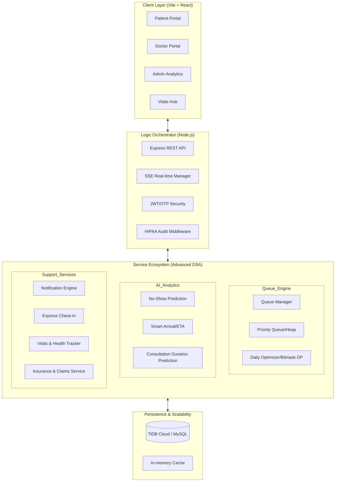
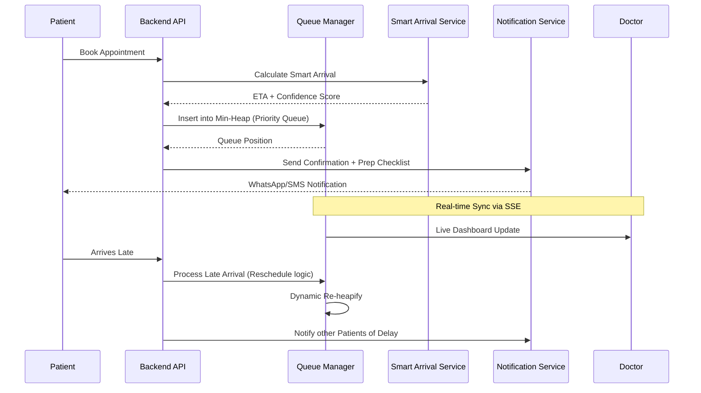

# Patient Appointment Scheduling System (HealthSync Premium)

A sophisticated, DSA-powered healthcare orchestration engine designed to eliminate patient wait times and optimize clinical workflows using Greedy Algorithms, Dynamic Programming, Priority Queues, Server-Sent Events, and Predictive Analytics.

---

## 🚀 Key Open-Source Features & Enhancements

* **DSA-Powered Queue Engine**: Combines **Bitmask Dynamic Programming** scheduling optimization with priority-heap queueing to yield minimal average wait times.
* **Real-time Live Synced Dashboards**: Leverages a resilient **Server-Sent Events (SSE)** infrastructure for sub-100ms dashboard synchronization (e.g., patient queue, messages, delays) with automatic exponential backoff.
* **Insurance Verification Phase 2**: Integrated **QR/Barcode scanning** utilizing `html5-qrcode` to scan card backs, a complete **Claims Tracking System** (database + CRUD routes + portal), and strict HIPAA compliance through a **PHI Audit Logging** middleware.
* **Auto-Recovery Migrations**: Automated pipeline execution to run database migrations automatically in the CI pipeline, preventing deployment inconsistencies.
* **Optimal Bundle Performance**: Implemented dynamic dynamic imports to lazy-load heavy PDF generator engines (`jsPDF` and `pdfkit`) on-demand, saving ~4MB from the critical initial render bundle.
* **Revocable Secure Sessions**: Refresh token expiration cron jobs running daily at 3:00 AM alongside strict logout session cleanups.

---

## 🏛️ System Architecture

### High-Level Component Interaction


### Core Workflow: Patient Journey


---

## 📊 Problem Statement & Solutions

HealthSync Premium addresses critical bottlenecks identified by WHO and NCBI through algorithmic precision.

### Stakeholder Impact Mapping

| Stakeholder | Critical Problem | DSA-Powered Solution | Algorithmic Approach |
|-------------|------------------|----------------------|----------------------|
| **Patient** | Long Wait Times | Wait Time Prediction | Historical DP + Real-time State |
| **Patient** | Emergency Delays | Emergency Override | Priority Queue (Min-Heap) |
| **Doctor** | Rushed Consults | Smart Buffer Allocation| Greedy Interval Packing |
| **Doctor** | Idle Time | Gap Filling Service | Predictive No-Show Modeling |
| **Admin** | Overbooking | Conflict Detection | Interval Intersection Algorithms |
| **Admin** | Manual Dispatching| Auto-Doctor Assignment | Greedy Load Balancing |

---

## 🧠 Advanced Service Ecosystem

The system's "Brain" resides in its modular service architecture, designed for high throughput and precision.

### 1. The Queue Engine
- **`dailyOptimizerService.js`**: Uses **Bitmask Dynamic Programming** ($O(2^n \cdot n)$) to reorder the day's schedule, minimizing the total weighted wait time for the entire clinic.
- **`lateArrivalService.js`**: Handles the "Late Arrival Paradox" by implementing policies like "Move to End of Session" or "Fit-in at Next Slot" based on current queue density.
- **`walkinPriorityService.js`**: Dynamically adjusts triage scores for walk-in patients to balance urgency with fairness.

### 2. AI & Predictive Analytics
- **`smartArrivalService.js`**: Integrates travel time estimation with patient historical data to generate a **Confidence Score** for their arrival, allowing the system to "overbook" low-confidence slots safely.
- **`durationPrediction.js`**: Uses weighted feature analysis (Symptom Complexity, Patient Age, Historical Speed) to predict how long a consultation will actually take, refining the live queue ETA.
- **`peakHoursService.js`**: Analyzes historical traffic to suggest optimal staffing levels for specific days/times.

### 3. Real-time Infrastructure & Core Services
- **`sseManager.js`**: A custom Server-Sent Events manager maintaining persistent, user-specific, and appointment-specific connections with active portals, pushing updates (e.g. real-time peer messages, queue updates) in <100ms.
- **`notificationService.js`**: A template-driven engine orchestrating multi-channel alerts (WhatsApp/Email/SMS) for delays, cancellations, and prep checklists.
- **`insuranceService.js`**: Leverages strategy patterns for mock/production eligibility calls, records claim history entries, and standardizes fetch calls.

---

## 🔬 Algorithm Deep Dive

| Feature | Primary Algorithm | Complexity | Purpose |
|-----------|-----------|------------|------------------|
| **Priority Queue** | Min-Heap | $O(\log N)$ | Instant re-ordering on new check-ins or emergency overrides. |
| **Schedule Optimization**| Bitmask DP | $O(2^N \cdot N)$| Finding the absolute minimum wait time sequence for $N$ patients. |
| **Slot Search** | Binary Search | $O(\log S)$ | Finding available time slots in a sorted availability array. |
| **Load Balancing** | Greedy | $O(D)$ | Assigning walk-ins to the least congested of $D$ doctors. |
| **Wait Estimation** | Dynamic Programming | $O(N)$ | Cumulative summation of predicted durations with real-time buffers. |

---

## 📂 Project Structure

```text
├── frontend/
│   ├── src/
│   │   ├── pages/         # 28+ Premium Screens (HealthSync Glassmorphism)
│   │   ├── components/    # Reusable UI components & scanner module
│   │   ├── contexts/      # Global State (Auth, Theme, Notifications)
│   │   └── services/      # Fetch-based API client wrappers (apiClient)
│   └── package.json       # React dependencies
└── backend/
    ├── database/          # Safe, Idempotent SQL seeds & migration engine
    ├── src/
    │   ├── services/      # Advanced Queue, AI, and Insurance logic
    │   ├── middleware/    # HIPAA PHI audit logging, Rate limiting, Auth
    │   ├── controllers/   # Route controller handlers
    │   └── server.js      # App bootstrap entrypoint
    ├── tests/             # Comprehensive Jest testing suites
    └── package.json       # Node API dependencies
```

---

## 🛠️ Tech Stack

* **Frontend**: React 19, Vite, Tailwind CSS, Framer Motion, Lucide Icons, html5-qrcode
* **Backend**: Node.js, Express.js, JWT, Winston (Winston Daily Rotate File logging), Nodemailer
* **Database**: MySQL / TiDB Cloud (Scalable Relational DB with auto-incrementing seeding)
* **Real-time**: Server-Sent Events (SSE) fallback with in-memory / Redis pub-sub
* **DevOps / CI**: GitHub Actions (MySQL CI service integration), Docker, Vercel

---

## 💻 Getting Started

### 1. Prerequisites
- Node.js (v20+)
- MySQL or TiDB Cloud instance

### 2. Local Setup
```bash
# Clone the repository
git clone https://github.com/ArchitMittal/Patient-Appointment-Scheduling-System.git
cd Patient-Appointment-Scheduling-System

# Install backend dependencies & configure env
cd backend
npm install
cp .env.example .env # Configure your database connection keys here

# Install frontend dependencies
cd ../frontend
npm install
cp .env.example .env
```

### 3. Database Initialization
```bash
# In the backend directory
npm run db:migrate # Applies all idempotent migration steps safely
```

### 4. Running Development Servers
```bash
# Start backend server (from backend/ directory)
npm run dev

# Start frontend server (from frontend/ directory)
npm run dev
```

### 5. Running Tests
```bash
# Run backend Jest unit & integration tests (from backend/ directory)
npm run test:backend

# Run frontend Vitest specs (from frontend/ directory)
npm run test
```

---

## 🤝 Contributing Guidelines

We welcome pull requests from everyone! Please check out [CONTRIBUTING.md](file:///Users/architmittal/Desktop/CODE/Patient%20Appointment%20Scheduling%20System/Patient-Appointment-Scheduling-System/CONTRIBUTING.md) to understand:
* Code Style & Commit message format guidelines
* Test requirements (Aiming for >80% coverage)
* HIPAA regulations & secure PHI access rules

---

## 👥 Contributors & Academic Context

- **Project Lead**: Archit Mittal
- **Project Members**: Aviral Mittal
- **Project Type**: Design & Analysis of Algorithms (DAA) - PBL
- **Status**: Production Ready / Stabilization Complete

---

## 📚 References
1. CLRS - *Introduction to Algorithms* (Chapters on Greedy & DP).
2. WHO Digital Health Framework.
3. NCBI - *Impact of Wait Times on Patient Outcomes*.
