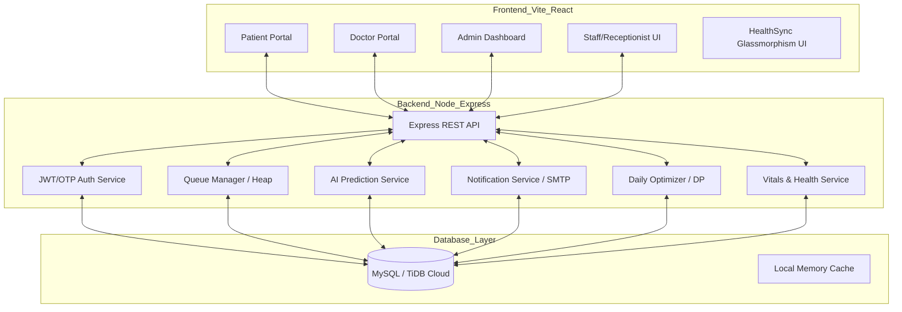

# Patient Appointment Scheduling System (HealthSync Premium)

A sophisticated, DSA-powered healthcare appointment scheduling system designed to eliminate patient wait times and optimize clinical workflows using Greedy Algorithms, Dynamic Programming, Priority Queues, and Predictive Analytics.

## 📋 Problem Statement

Manual patient appointment scheduling in healthcare facilities leads to long wait times, scheduling conflicts, inefficient doctor utilization, and poor emergency handling. This results in patient dissatisfaction, wasted resources, and potential health risks for urgent cases.

### Research-Backed Problems

#### A. Patient-Facing Problems (Primary Stakeholder)

| Problem | Source/Evidence | Impact | Our Solution |
|---------|-----------------|--------|---------------|
| Long waiting times | WHO: "Workflow disruptions affect patient care delivery" | HIGH | Wait time prediction (DP) |
| No-show uncertainty | Studies show 15-30% no-show rates in OPDs | HIGH | Predictive rescheduling + SMS reminders |
| Manual queue guessing | Receptionists estimate times incorrectly | MEDIUM | Real-time wait estimation algorithm |
| Emergency delays | Non-priority based queues delay urgent cases | CRITICAL | Priority Queue with emergency override |
| Multiple visits for booking | Lack of real-time slot visibility | MEDIUM | Online slot availability (Binary Search) |
| Communication gaps | WHO: "Communication breakdown among healthcare workers and patients" | HIGH | Automated SMS/Email notifications |
| Patient misidentification | WHO reports 12.3% of sentinel events | MEDIUM | Unique Patient ID (UID) verification |

#### B. Receptionist/Admin Problems (Secondary Stakeholder)

| Problem | Evidence | Our Solution |
|---------|----------|---------------|
| Overbooking conflicts | Manual systems can't detect overlaps | Interval conflict detection (Greedy) |
| No-show management | Empty slots waste doctor time | Predictive no-show model + waitlist |
| Emergency insertion chaos | Disrupts entire day's schedule | Priority Queue with dynamic reheapify |
| Uneven doctor distribution | Some doctors overloaded, others idle | Load balancing algorithm |
| 25% time on admin tasks | NCBI: "Average nurse spends 25% on administrative activities" | Automation reduces manual work |
| Paper-based errors | EHR studies show paper systems increase errors | Digital scheduling system |

#### C. Doctor-Facing Problems

| Problem | Impact | Our Solution |
|---------|--------|---------------|
| Rushed consultations | Poor patient outcomes | Buffer time allocation (Greedy) |
| Idle time between patients | Lost productivity | Optimal slot packing (DP) |
| No visibility into schedule | Can't prepare for complex cases | Real-time dashboard |
| Variable case complexity | 10-min vs. 45-min appointments mixed poorly | Weighted job scheduling |

---

## 🏗️ System Architecture



---

## 📖 Project Explanation

The **Patient Appointment Scheduling System** is more than just a booking tool; it is an intelligent orchestration engine for clinics. It manages the entire patient journey through three distinct stages:

### 1. Pre-Visit: Smart Booking & Preparation
- **Intelligent Slot Selection**: Uses a **Greedy "First-Fit" Algorithm** to suggest the earliest available slot while maintaining mandatory buffer zones between appointments.
- **Predictive No-Show Scoring**: As soon as a patient books, the system calculates a "No-Show Probability" score based on historical reliability and appointment lead time. High-risk slots are tagged for automated reminders.

### 2. At-Clinic: Real-Time Queue Orchestration
- **Priority-Based Check-in**: When a patient arrives, they are inserted into a **Min-Heap Priority Queue**. Their position is determined by their `Urgency Score` (Triage), `Wait Time` (to prevent starvation), and `Appointment Type`.
- **Emergency Management**: Staff can trigger an "Emergency Override," which inserts a patient at the top of the queue and triggers a **Dynamic Re-heapify** operation to adjust everyone else's estimated wait times instantly.
- **Digital Vitals Tracking**: Nurses record vitals (BP, SpO2, etc.) directly into the system, which are then instantly accessible to the doctor before the patient even enters the cabin.

### 3. Clinical Workflow: Advanced Optimization
- **Dynamic Reordering (Bitmask DP)**: The system doesn't just process patients in arrival order. A **Dynamic Programming** service periodically reorders the waiting sequence to minimize the **Total Weighted Delay** (ensuring critical patients are seen faster without making others wait excessively).
- **Load Balancing**: For walk-in patients, the system analyzes the current "Workload" (Waiting Patients × Predicted Duration) of every doctor in the department and suggests the one with the lowest congestion.

---

## 📂 Project Structure

### 🖥️ Frontend (`/frontend`)
Built with **React 18** and **Vite** for blazing fast performance and a premium user experience.

- **`src/pages/`**: Contains 28+ specialized screens including:
    - `DoctorDashboard.jsx`: Real-time queue monitor with patient risk profiles.
    - `PatientDashboard.jsx`: Personal booking management and live queue tracking.
    - `AdminAnalytics.jsx`: High-level metrics on clinic efficiency and doctor utilization.
    - `VitalsHub.jsx`: Interactive dashboard for monitoring patient health data.
- **`src/contexts/`**: Centralized state management for `AuthContext` (JWT session) and `ThemeContext` (HealthSync Premium UI).
- **`src/services/`**: API abstraction layer using `Axios` for secure communication with the backend.

### ⚙️ Backend (`/backend`)
A robust **Node.js/Express** micro-service architecture.

- **`src/services/`**: The "Brain" of the system:
    - `dailyOptimizerService.js`: Implements **Bitmask DP** for schedule optimization.
    - `predictionService.js`: Weighted scoring models for no-show and churn prediction.
    - `notificationService.js`: Multi-channel (Push/SMS/Email) template engine.
    - `vitalsService.js`: Manages real-time health data ingestion and alerts.
- **`src/controllers/`**: Handles request validation and orchestrates service calls.
- **`src/routes/`**: Clean, RESTful API endpoints organized by resource (Auth, Appointments, Queue, etc.).
- **`database/`**: SQL migration scripts and stored procedures for database-level DSA operations.

---

## 🛠️ Tech Stack

- **Frontend**: React 18, Vite, Tailwind CSS, Framer Motion (Animations), Lucide Icons
- **Backend**: Node.js, Express.js, JWT (Security), Nodemailer (SMTP/Email)
- **Database**: MySQL / TiDB Cloud (Scalable Relational DB)
- **State Management**: React Context API + Custom Hooks
- **DevOps**: Dockerized for seamless deployment on Hugging Face (Backend) and Vercel (Frontend)

---

## 📈 Algorithm Deep Dive

| Feature | Algorithm | Purpose |
|-----------|-----------|------------------|
| **Queue Order** | Min-Heap | O(log n) insertion and extraction for priority management. |
| **Schedule Reordering**| Bitmask DP | Minimizes weighted wait time ($O(2^n \cdot n)$). |
| **Walk-in Routing** | Greedy Load Balancing | Distributes patients based on real-time doctor workload. |
| **Wait Estimation** | Historical DP | Combines real-time queue state with historical duration patterns. |
| **No-Show Model** | Weighted Feature Scoring | Proactively identifies high-risk appointments. |

---

## 🚀 Getting Started

### 1. Prerequisites
- Node.js (v18+)
- MySQL or TiDB Cloud instance

### 2. Installation
```bash
# Clone the repository
git clone https://github.com/ArchitMittal/Patient-Appointment-Scheduling-System.git
cd Patient-Appointment-Scheduling-System

# Setup Backend
cd backend && npm install
cp .env.example .env # Add your DB and SMTP credentials

# Setup Frontend
cd ../frontend && npm install
cp .env.example .env
```

### 3. Run Development Servers
```bash
# Backend (from backend directory)
npm run dev

# Frontend (from frontend directory)
npm run dev
```

---

## 📅 Project Milestones (Status: COMPLETED)

- [x] **Phase 1: Foundation**: Database Schema, JWT Auth, Basic CRUD.
- [x] **Phase 2: Core DSA**: Priority Queue implementation, Greedy slot allocation, Wait prediction.
- [x] **Phase 3: AI & Optimization**: No-show model, Bitmask DP sequencing, Load balancing.
- [x] **Phase 4: Premium UI**: HealthSync Glassmorphism redesign, Responsive layouts.
- [x] **Phase 5: Stabilization**: SMTP recovery, Real-time polling, Production deployment.

---

## 👥 Contributors

- **Project Lead**: Archit Mittal (PBL Team - DAA Project 2026)

---

## 📚 References
1. WHO Patient Safety Guidelines & Global Health Statistics.
2. NCBI - "Administrative Burden in Healthcare".
3. CLRS - Introduction to Algorithms (Greedy, DP, Heaps).
4. IBEF Healthcare Sector Reports. 
