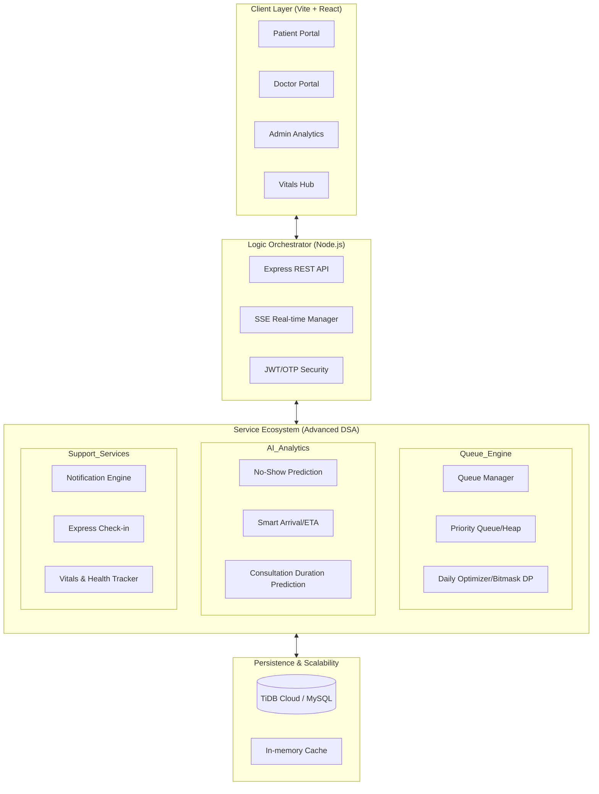
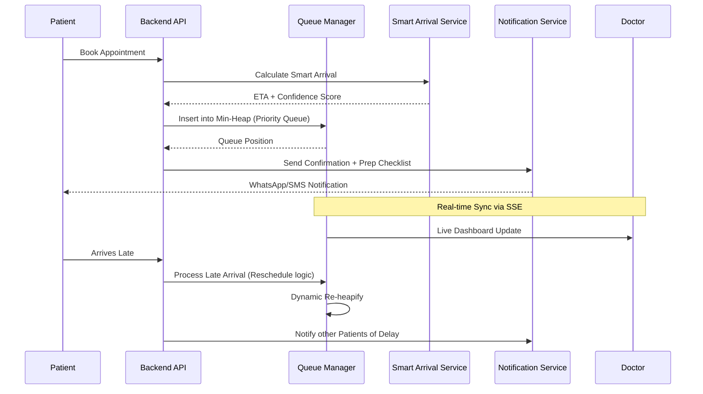

# Patient Appointment Scheduling System (HealthSync Premium)

A sophisticated, DSA-powered healthcare orchestration engine designed to eliminate patient wait times and optimize clinical workflows using Greedy Algorithms, Dynamic Programming, Priority Queues, and Predictive Analytics.

---

## 🏗️ System Architecture

### High-Level Component Interaction


### Core Workflow: Patient Journey


---

## 📋 Problem Statement & Solutions

HealthSync Premium addresses critical bottlenecks identified by WHO and NCBI through algorithmic precision.

### Stakeholder Impact Mapping

| Stakeholder | Critical Problem | DSA-Powered Solution | Algorithmic Approach |
|-------------|------------------|----------------------|----------------------|
| **Patient** | Long Wait Times | Wait Time Prediction | Historical DP + Real-time State |
| **Patient** | Emergency Delays | Emergency Override | Priority Queue (Min-Heap) |
| **Doctor** | Rushed Consults | Smart Buffer Allocation| Greedy Interval Packing |
| **Doctor** | Idle Time | Gap Filling Service | Predictive No-Show Modeling |
| **Admin** | Overbooking | Conflict Detection | Interval Intersection Algorithms |
| **Admin** | Manual Dispatching| Auto-Doctor Assignment | Greedy Load Balancing |

---

## ⚙️ Advanced Service Ecosystem

The system's "Brain" resides in its modular service architecture, designed for high throughput and precision.

### 1. The Queue Engine
- **`dailyOptimizerService.js`**: Uses **Bitmask Dynamic Programming** ($O(2^n \cdot n)$) to reorder the day's schedule, minimizing the total weighted wait time for the entire clinic.
- **`lateArrivalService.js`**: Handles the "Late Arrival Paradox" by implementing policies like "Move to End of Session" or "Fit-in at Next Slot" based on current queue density.
- **`walkinPriorityService.js`**: Dynamically adjusts triage scores for walk-in patients to balance urgency with fairness.

### 2. AI & Predictive Analytics
- **`smartArrivalService.js`**: Integrates travel time estimation with patient historical data to generate a **Confidence Score** for their arrival, allowing the system to "overbook" low-confidence slots safely.
- **`durationPrediction.js`**: Uses weighted feature analysis (Symptom Complexity, Patient Age, Historical Speed) to predict how long a consultation will actually take, refining the live queue ETA.
- **`peakHoursService.js`**: Analyzes historical traffic to suggest optimal staffing levels for specific days/times.

### 3. Real-time Infrastructure
- **`sseManager.js`**: A custom Server-Sent Events manager that maintains persistent connections with all active portals, ensuring that a change in the doctor's cabin is reflected on the patient's phone in <100ms.
- **`notificationService.js`**: A template-driven engine that orchestrates multi-channel alerts (Email/SMS) for delays, cancellations, and prep requirements.

---

## 📈 Algorithm Deep Dive

| Feature | Primary Algorithm | Complexity | Purpose |
|-----------|-----------|------------|------------------|
| **Priority Queue** | Min-Heap | $O(\log N)$ | Instant re-ordering on new check-ins or emergency overrides. |
| **Schedule Optimization**| Bitmask DP | $O(2^N \cdot N)$| Finding the absolute minimum wait time sequence for $N$ patients. |
| **Slot Search** | Binary Search | $O(\log S)$ | Finding available time slots in a sorted availability array. |
| **Load Balancing** | Greedy | $O(D)$ | Assigning walk-ins to the least congested of $D$ doctors. |
| **Wait Estimation** | Dynamic Programming | $O(N)$ | Cumulative summation of predicted durations with real-time buffers. |

---

## 📂 Project Structure

```text
├── frontend/src
│   ├── pages/          # 28+ Premium Screens (HealthSync Glassmorphism)
│   ├── components/     # Reusable UI Atoms & Molecules
│   ├── contexts/       # Global State (Auth, Theme, Notifications)
│   └── services/       # API abstraction layer
└── backend/src
    ├── services/       # DSA Brains (Queue, Optimization, AI)
    ├── controllers/    # Request orchestration
    ├── routes/         # REST API Design
    └── config/         # Environment & Security (JWT, TiDB)
```

---

## 🛠️ Tech Stack

- **Frontend**: React 18, Vite, Tailwind CSS, Framer Motion, Lucide Icons
- **Backend**: Node.js, Express.js, JWT, Nodemailer (SMTP)
- **Database**: MySQL / TiDB Cloud (Scalable Relational DB)
- **Real-time**: Server-Sent Events (SSE)
- **DevOps**: Docker, Vercel, Hugging Face

---

## 🚀 Getting Started

### 1. Prerequisites
- Node.js (v18+)
- MySQL or TiDB Cloud instance

### 2. Installation
```bash
git clone https://github.com/ArchitMittal/Patient-Appointment-Scheduling-System.git
cd Patient-Appointment-Scheduling-System

# Setup Backend & Frontend
cd backend && npm install
cp .env.example .env
cd ../frontend && npm install
cp .env.example .env
```

### 3. Execution
```bash
# In separate terminals:
cd backend && npm run dev
cd frontend && npm run dev
```

---

## 👥 Contributors & Academic Context

- **Project Lead**: Archit Mittal
- **Project Type**: Design & Analysis of Algorithms (DAA) - PBL
- **Status**: Production Ready / Stabilization Complete

---

## 📚 References
1. CLRS - *Introduction to Algorithms* (Chapters on Greedy & DP).
2. WHO Digital Health Framework.
3. NCBI - *Impact of Wait Times on Patient Outcomes*.
